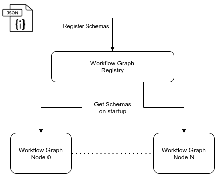

# workflow-graph-registry

AVRO Schema registry built with Spring Cloud Schema Registry.

## Why

Robust automation of running workflows necessitates the elimination of as many "runtime" errors as possible. This is not only to eliminate the potential waste of compute resources but also to make it easier to reason about errors that do arise.

One such error that we can avoid at runtime, is the the error of incorrect inputs being passed to a scheduled workflow. We can accomplish this through the use of schemas, validating the input parameters based on the workflow they are meant for. This way, we can capture these errors before a workflow is ever scheduled.

Given our need to version workflows and their schemas, as well as our reliance on technologies like kafka and rabbitmq, we have settled on AVRO schemas as our solution for this problem.

## Technologies

- AVRO
- Java 11
- Spring Boot
- Spring Cloud Schema Registry
- Postgresql

## Build

This application is built with maven.

```bash
./mvnw clean package
```

## Run

Run with maven:

```bash
./mvnw spring-boot:run
```

Run the uber jar directly:

```shell
java -jar target/workflow-graph-registry-0.0.1-SNAPSHOT.jar
```

## Usage

### Add Schema

```shell
curl --location --request POST 'http://localhost:8080/' \
--header 'Content-Type: application/json' \
--data-raw '{
    "subject": "AlignParamsTest",
    "format": "avro",
    "definition": "{   \"type\" : \"record\",   \"name\" : \"AlignParamsTest\",   \"namespace\": \"org.icgc_argo.workflow_graph_lib.schema\",   \"fields\" : [      {        \"name\" : \"analysis_id\" ,        \"type\" : \"string\"      },      {        \"name\" : \"study_id\" ,        \"type\" : \"string\"      },      {        \"name\" : \"score_url\" ,        \"type\" : \"string\"      },      {        \"name\" : \"song_url\" ,        \"type\" : \"string\"      },      {        \"name\": \"ref_genome_fa\",        \"type\": \"string\"      },      {        \"name\": \"download\",        \"type\": {  \"type\": \"record\",  \"name\": \"downloadRecord\",  \"fields\" : [      {\"name\" : \"song_cpus\" ,\"type\" : \"int\"      },      {\"name\" : \"song_mem\" ,\"type\" : \"int\"      },      {\"name\" : \"score_cpus\" ,\"type\" : \"int\"      },      {\"name\" : \"score_mem\" ,\"type\" : \"int\"      },      {\"name\": \"score_url\",\"type\": \"string\"      },      {\"name\": \"song_url\",\"type\": \"string\"      }  ]        }      },      {\"name\": \"cpu\",\"type\": \"int\"      },      {\"name\": \"mem\",\"type\": \"int\"      }   ]}"
}'
```

### Get Schema

```shell
curl --location --request GET 'http://localhost:8080/AlignParamsTest/avro/v1' \
--header 'Content-Type: application/json'
```

## System Integration

When workflow nodes startup, they request a specific schema based on their configured workflow information.


